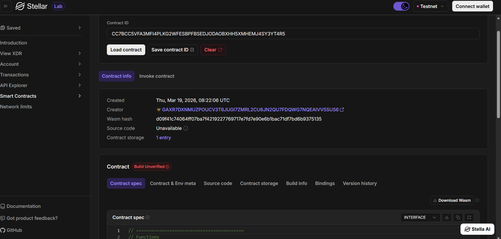

# NFT Rental Platform (Soroban Smart Contract)

## 📌 Project Description
NFT Rental Platform is a decentralized smart contract built on the Stellar Soroban framework that enables NFT owners to rent out their digital assets securely and efficiently.

This platform allows users to monetize their NFTs by temporarily granting access rights to other users without transferring ownership.

---

## 🚀 What It Does
The smart contract provides a simple NFT rental mechanism where:
6
- NFT owners can mint tokens (basic ownership assignment)
- Owners can rent their NFTs to other users for a fixed duration
- Rental agreements are recorded on-chain
- Ownership remains with the original owner during rentals
- Rentals automatically expire based on time

---

link  https://lab.stellar.org/smart-contracts/contract-explorer?$=network$id=testnet&label=Testnet&horizonUrl=https:////horizon-testnet.stellar.org&rpcUrl=https:////soroban-testnet.stellar.org&passphrase=Test%20SDF%20Network%20/;%20September%202015;&smartContracts$explorer$contractId=CC7BCC5VFA3MFI4PLKG2WFESBPFBSEDJODAOBXHH5XMHEMJ4SY3YT4R5;;

## ✨ Features

### 🔹 NFT Minting
- Assign ownership of a token ID to a user

### 🔹 Rental System
- Rent NFTs without transferring ownership
- Define rental duration
- Track renter and expiry time

### 🔹 Ownership Verification
- Ensures only the rightful owner can rent or manage NFTs

### 🔹 Rental Expiry Handling
- Rentals expire based on timestamps
- Owners can manually terminate rentals

### 🔹 On-chain Storage
- Rental and ownership data stored securely on-chain

---

## 🛠️ Tech Stack
- **Soroban SDK (Rust)**
- **Stellar Blockchain**

---

## 📜 Smart Contract Functions

| Function        | Description |
|----------------|------------|
| `mint`         | Creates a new NFT |
| `rent`         | Rent NFT to another user |
| `get_owner`    | Returns NFT owner |
| `get_rental`   | Returns rental details |
| `end_rental`   | Ends rental agreement |

---

## 🔗 Deployed Smart Contract Link
NFT Rental Platform: _Add your deployed contract link here_

Example: